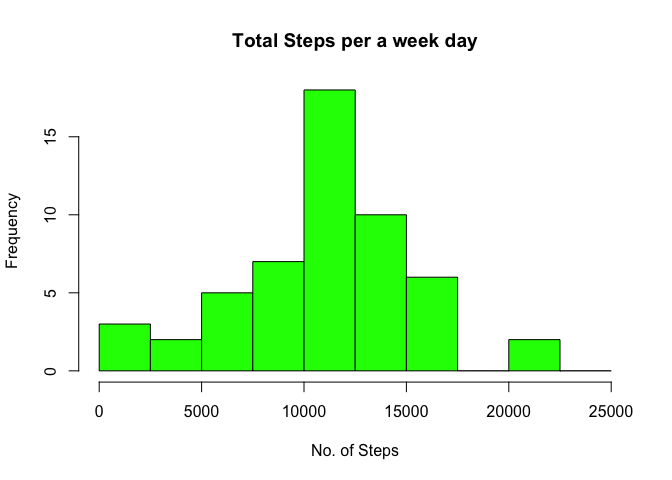
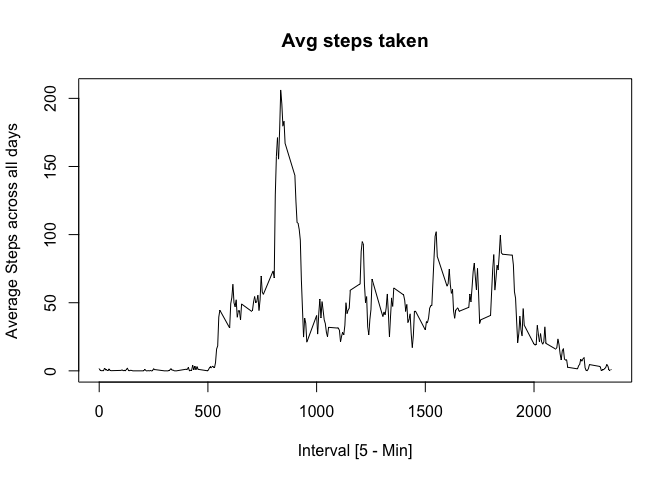
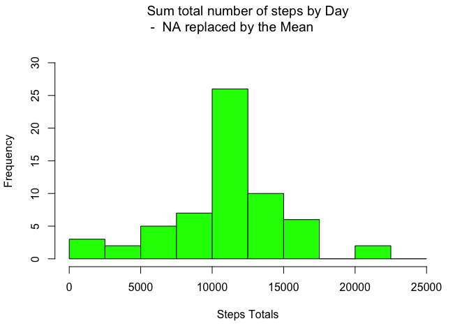
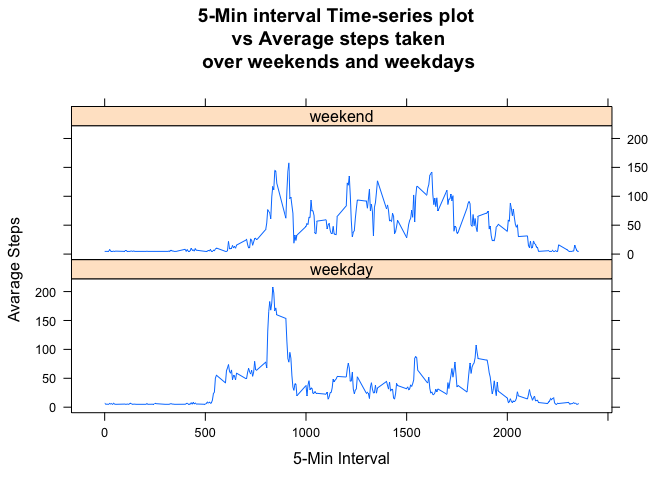
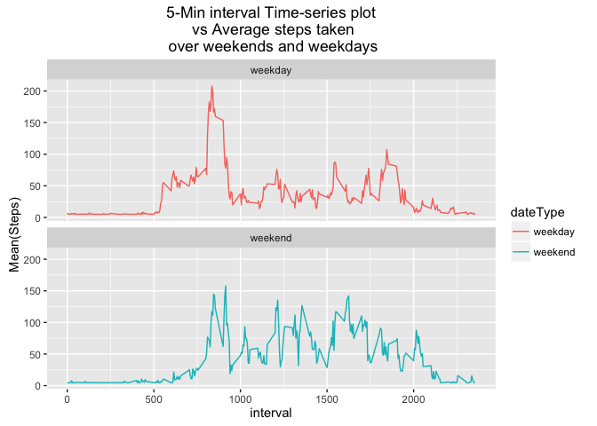

# Reproducible Research: Peer Assessment 1
Kimamö Wachira  
`r format(Sys.time(), '%d %B, %Y')`  

```r
## load libraries
library(ggplot2)
```

```
## Warning: package 'ggplot2' was built under R version 3.2.3
```

```r
library(plyr)
library(knitr)
library(reshape2)
library(lattice)
```


## Loading and preprocessing the data
the zip file variable <br>

```r
activityZipFile <- "activity.zip"
```

 <br> get current working dir <br>
 

```r
projDir <- getwd()
```
 <br> traverse back for zip dir <br>


```r
setwd("..")
```
<br> set to zipped dir <br>

```r
zipFileDir  <- getwd()
```
<br>
reset to back to working project folder  <br>

```r
setwd(projDir)
zipFilePath <- paste(zipFileDir,activityZipFile,sep = "/")
activityCSVFullPath <- paste(projDir,"activity.csv", sep = "/")
```

#######check if unzipped file exists

```r
if (!file.exists(activityCSVFullPath)) {
   ##Unzip downloaded file
  unzip(zipfile = zipFilePath,exdir = projDir)
}
```

########Read Activity File

```r
dataActivity <- read.csv(file.path(activityCSVFullPath),header = TRUE, 
sep = ',', stringsAsFactors = F, na.strings = c("NA","NaN", " "),
colClasses = c("numeric", "character","integer"))

str(dataActivity)
```

```
## 'data.frame':	17568 obs. of  3 variables:
##  $ steps   : num  NA NA NA NA NA NA NA NA NA NA ...
##  $ date    : chr  "2012-10-01" "2012-10-01" "2012-10-01" "2012-10-01" ...
##  $ interval: int  0 5 10 15 20 25 30 35 40 45 ...
```

<br>

```r
dataActivity$DateTime  <- as.POSIXct(dataActivity$date, format = "%Y-%m-%d")
dataActivity$day <- weekdays(as.Date(dataActivity$date))
weekends <- weekdays(as.Date(dataActivity$date)) %in% c("Saturday","Sunday")
head(weekends, tail(20))
```

```
##  [1] FALSE FALSE FALSE FALSE FALSE FALSE FALSE FALSE FALSE FALSE FALSE
## [12] FALSE FALSE FALSE FALSE FALSE FALSE FALSE FALSE FALSE
```

```r
#make dataType weekday then logically replace swap it with weekend if meets the weekend logic
dataActivity$dateType <- "weekday"
dataActivity$dateType[weekends == TRUE] <-"weekend"

head(dataActivity)
```

```
##   steps       date interval   DateTime    day dateType
## 1    NA 2012-10-01        0 2012-10-01 Monday  weekday
## 2    NA 2012-10-01        5 2012-10-01 Monday  weekday
## 3    NA 2012-10-01       10 2012-10-01 Monday  weekday
## 4    NA 2012-10-01       15 2012-10-01 Monday  weekday
## 5    NA 2012-10-01       20 2012-10-01 Monday  weekday
## 6    NA 2012-10-01       25 2012-10-01 Monday  weekday
```


```r
#Compute steps per day

aggrDaySteps <-aggregate(dataActivity$steps ~ dataActivity$date, FUN = sum, na.rm=TRUE)
colnames(aggrDaySteps) <- c("Date","Steps")
head(aggrDaySteps)
```

```
##         Date Steps
## 1 2012-10-02   126
## 2 2012-10-03 11352
## 3 2012-10-04 12116
## 4 2012-10-05 13294
## 5 2012-10-06 15420
## 6 2012-10-07 11015
```
##### Histogram of the total number of steps taken each day 


```r
#png(filename = "steps.png")

hist(
  aggrDaySteps$Steps, breaks = seq(from=0, to=25000, by=2500) ,col = "green", xlab = "No. of Steps", main = "Total Steps per a week day"
)
```



```r
#dev.off()
```


## What is mean total number of steps taken per day?


```r
meanSteps <- round(as.integer(mean(aggrDaySteps$Steps, na.rm = TRUE)))
medianSteps <- as.integer(median(aggrDaySteps$Steps,na.rm = TRUE))

paste("Mean steps per day: ", meanSteps)
```

```
## [1] "Mean steps per day:  10766"
```

```r
paste("Median steps per day: ", medianSteps)
```

```
## [1] "Median steps per day:  10765"
```


## What is the average daily activity pattern?


```r
## Mean and median number of steps taken each day.
meanAggr <-
  tapply(dataActivity$steps, dataActivity$interval,  mean ,na.rm = TRUE)
 
# ## Time series plot of the average number of steps taken

#png("plot-ts.png")
plot(row.names(meanAggr), meanAggr,  type = "l",
     xlab="Interval [5 - Min]", ylab="Average Steps across all days" ,main ="Avg steps taken" )
```



```r
#dev.off()

## The 5-minute interval that, on average, contains the maximum number of steps
##get maximum
maxSteps <- which.max(meanAggr)
## print interval with max
paste("interval with max steps is :- ", names(maxSteps))
```

```
## [1] "interval with max steps is :-  835"
```
## Imputing missing values

```r
#find the total NA
totalNA <- sum(is.na(dataActivity$steps))
paste("No of Missing values = ", totalNA)
```

```
## [1] "No of Missing values =  2304"
```

```r
#rows with missing steps
missingRow <- nrow(dataActivity[is.na(dataActivity$steps),])

## filling the missing data with day average of 5 min interval values
#data  of all NA rows
isNAdata <- dataActivity[is.na(dataActivity$steps),]
# get mean steps
meanSteps <- rep(mean(dataActivity$steps, na.rm = TRUE), times = length(isNAdata))

#find position of NA data to be swapped with mean steps
posOfNA <- which(is.na(dataActivity$steps))

#replace NA's with MeanSteps
dataActivity[posOfNA,"steps"] <- meanSteps
head(dataActivity, tail(15))
```

```
##      steps       date interval   DateTime    day dateType
## 1  37.3826 2012-10-01        0 2012-10-01 Monday  weekday
## 2  37.3826 2012-10-01        5 2012-10-01 Monday  weekday
## 3  37.3826 2012-10-01       10 2012-10-01 Monday  weekday
## 4  37.3826 2012-10-01       15 2012-10-01 Monday  weekday
## 5  37.3826 2012-10-01       20 2012-10-01 Monday  weekday
## 6  37.3826 2012-10-01       25 2012-10-01 Monday  weekday
## 7  37.3826 2012-10-01       30 2012-10-01 Monday  weekday
## 8  37.3826 2012-10-01       35 2012-10-01 Monday  weekday
## 9  37.3826 2012-10-01       40 2012-10-01 Monday  weekday
## 10 37.3826 2012-10-01       45 2012-10-01 Monday  weekday
## 11 37.3826 2012-10-01       50 2012-10-01 Monday  weekday
## 12 37.3826 2012-10-01       55 2012-10-01 Monday  weekday
## 13 37.3826 2012-10-01      100 2012-10-01 Monday  weekday
## 14 37.3826 2012-10-01      105 2012-10-01 Monday  weekday
## 15 37.3826 2012-10-01      110 2012-10-01 Monday  weekday
```

```r
aggrByDay <- aggregate(dataActivity$steps, by=list(dataActivity$date),FUN =sum)

#Friendly name the columns
names(aggrByDay) <- c("date", "totals")

#plot hist based on step totals each day
#png("histPlot-withMean")
hist(aggrByDay$totals, breaks=seq(from=0,to=25000,by=2500), col = "green", xlab = "Steps Totals", 
     main=expression("Sum total number of steps by Day\n -  NA replaced by the Mean "), ylim=c(0,30))
```



```r
#dev.off()


meanSteps1 <- round(as.integer(mean(aggrByDay$ totals, na.rm = TRUE)))
medianSteps1 <- as.integer(median(aggrByDay$totals,na.rm = TRUE))

#Do these values differ from the estimates from the first part of the assignment

paste("Mean steps per day after NA swap: ", meanSteps1)
```

```
## [1] "Mean steps per day after NA swap:  10766"
```

```r
paste("Median steps per day after NA swap: ", medianSteps1)
```

```
## [1] "Median steps per day after NA swap:  10766"
```
## Are there differences in activity patterns between weekdays and weekends?


```r
#Create a new factor variable in the dataset with two levels 
# – “weekday” and “weekend” indicating whether a given date is a weekday or weekend day.
#factorize dataType
dataActivity$dateType <- as.factor(dataActivity$dateType)
 
dataAgg <- aggregate(steps ~ interval + dateType, dataActivity, "Mean(Steps)" = mean, FUN = mean)

names(dataAgg)[3] <-"Mean(Steps)"
head(dataAgg)
```

```
##   interval dateType Mean(Steps)
## 1        0  weekday    7.006569
## 2        5  weekday    5.384347
## 3       10  weekday    5.139902
## 4       15  weekday    5.162124
## 5       20  weekday    5.073235
## 6       25  weekday    6.295458
```

```r
# diagram  a time-series plot for weekend and weekdays
#png("wkend-wkdays-avg-intervals.png")
xyplot(dataAgg$`Mean(Steps)`~ interval | dateType , dataAgg, type = "l", layout =c(1,2), 
       main = "5-Min interval Time-series plot\n vs Average steps taken\n over weekends and weekdays",
xlab="5-Min Interval", ylab="Avarage Steps")
```



```r
ts <- ggplot(dataAgg, aes(x=interval, y=`Mean(Steps)`, color = dateType)) +
  geom_line() + ggtitle("5-Min interval Time-series plot\n vs Average steps taken\n over weekends and weekdays")+
  facet_wrap(~dateType, ncol = 1, nrow=2)
print(ts)
```



```r
#dev.off()
```

## the end.....
date: "14 February, 2016"

